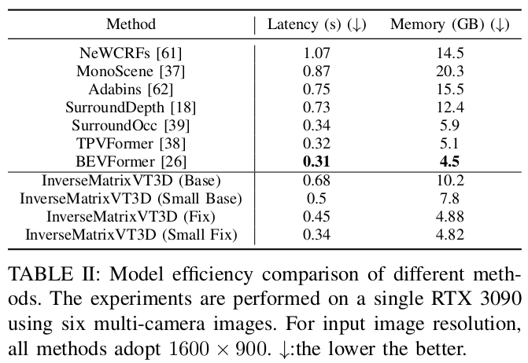

# InverseMatrixVT3D
InverseMatrixVT3D: An Efficient Projection Matrix-Based Approach for 3D Occupancy Prediction [[Paper](https://arxiv.org/pdf/2401.12422.pdf)]
# Abstract
This paper introduces InverseMatrixVT3D, an efficient method for transforming multi-view image features into 3D feature volumes for 3D semantic occupancy prediction. Existing methods for constructing 3D volumes often rely on depth estimation, device-specific operators, or transformer queries, which hinders the widespread adoption of 3D occupancy models. In contrast, our approach leverages two projection matrices to store the static mapping relationships and matrix multiplications to efficiently generate global Bird's Eye View (BEV) features and local 3D feature volumes. Specifically, we achieve this by performing matrix multiplications between multi-view image feature maps and two sparse projection matrices. We introduce a sparse matrix handling technique for the projection matrices to optimise GPU memory usage. Moreover, a global-local attention fusion module is proposed to integrate the global BEV features with the local 3D feature volumes to obtain the final 3D volume. We also employ a multi-scale supervision mechanism to enhance performance further. Comprehensive experiments on the nuScenes dataset demonstrate the simplicity and effectiveness of our method.
# Method Pipeline

<p align='center'>

</p>

# Getting Started
- [Installation](docs/install.md)
- [Dataset](docs/dataset.md)
- [Run and Eval](docs/getting_started.md)
# Performance

<p align='center'>

</p>

# Model Efficiency

<p align='center'>

</p>

# Model Zoo
| Backbone | Config | Image Size | Epochs |  Pretrain | Memory | mIoU | Model Weights |
| :---: | :---: | :---: | :---: | :---: | :---: | :---: | :---: | 
| R101-DCN | [InverseMatrixVT3D-base](./configs/InverseMatrixVT3D_256_256_32.py) | $1600\times900$ | 4 | nus-det | 16 G | 26.03 | [ckpt](https://drive.google.com/file/d/1ll7qDg4nGMc-SMtMKxW8-hhlxNS6Xtic/view?usp=sharing)
| R101-DCN | [InverseMatrixVT3D-small](./configs/InverseMatrixVT3D_200_200_16.py) | $1600\times900$ | 4 | nus-det | 14 G | 25.95 | [ckpt](https://drive.google.com/file/d/1xuPH9ak5uctAH-UGipFbr6pJMKm6lLOv/view?usp=sharing)

The user can get a fixed version result by setting enable_fix=True in each config file.

## Acknowledgement
Many thanks to these excellent projects:
- [SurroundOcc](https://github.com/weiyithu/SurroundOcc)
- [OccFormer](https://github.com/zhangyp15/OccFormer)
- [PanoOcc](https://github.com/Robertwyq/PanoOcc)
- [MonoScene](https://github.com/astra-vision/MonoScene)
## Bibtex
If this work is helpful for your research, please consider citing the following BibTeX entry.

```
@article{ming2024inversematrixvt3d,
  title={InverseMatrixVT3D: An Efficient Projection Matrix-Based Approach for 3D Occupancy Prediction},
  author={Ming, Zhenxing and Berrio, Julie Stephany and Shan, Mao and Worrall, Stewart},
  journal={arXiv preprint arXiv:2401.12422},
  year={2024}
}
```
